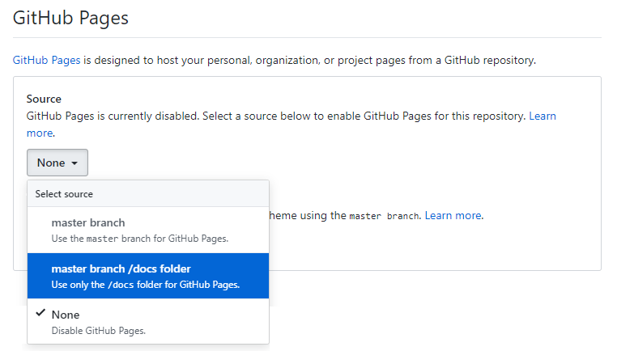
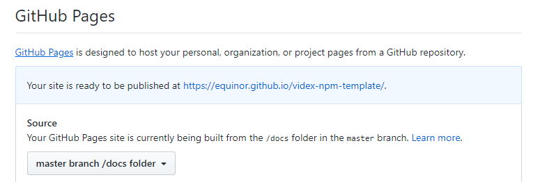

# Intersection component
A reusable component to create intersection visualizations for wells


## Technical choices

- **Compiler**: [Typescript](https://www.npmjs.com/package/typescript)
- **Module bundler**: [Rollup](https://www.npmjs.com/package/rollup)
- **Testing**: [Jest](https://www.npmjs.com/package/jest)
- **Documentation**: [TypeDoc](https://www.npmjs.com/package/typedoc)
- **Code compressor**: [Terser](https://www.npmjs.com/package/terser)
- **Miscellaneous**:
  - Architecture: A container component that holds several layers, specialized for the type of data and visualization they address (analogous to the VidEx-map component https://github.com/equinor/videx-map)
  - Browser support: Target Edge, Chrome, Firefox, Safari
  - Styling: To be defined. Possibly SCSS or Emotion
  - Testing:
    - linting and unit tests, with test coverage - run automatically on Github Actions
    - possibly snapshot tests at a later stage
    - later on simulation tests, depending on resources and requirements
  - Dependencies: 
    - _d3_
    - each layer can include additional dependencies
  - Accessibility: investigate compliance with WCAG2.1 (poossibly automatically)
  - Publishing:
    - automated
    - both tagged releases (semantic versioning) and nightly


## Development methodology
- The _Product Owners_ of the Intersection component are @farzadfz and @thuve 
- Development is driven by _user stories_, created and prioritized by developers and POs together
- User stories can be grouped into _milestones_. A milestone represents what is expected to be achieved in about 2 months of development
- The development team has _planning meetings_ with the POs once a week
- The development team has _daily standups_, POs participation is optional but very much encouraged
- Development relies on a _project board_ hosted on github (https://github.com/equinor/intersection/projects/1)
- During planning meetings, the `To do` column of the board is populated with user stories and tasks
- What is placed in the `To do` column is expected to be completed in 1 week of normal work
- At the developers discretion, a _technical planning meeting_ can be held after the planning
- During a _technical planning meeting_, current user stories and tasks can be discussed and potentially split into smaller tasks
- A _demo_ for the stakeholders will be held approximately every 4 weeks
  - Stakeholders for the _WellX_ and _REP_ projects (including the _REP reference user group_) should be invited to the demo 


## Resources
- **Repository**: [GitHub](https://github.com/equinor/intersection)


--- The following part comes from the template and needs to be revised further ---
## Setup guide

### Cloning repository

Start by cloning the template repository to desired directory.

```
git clone https://github.com/equinor/videx-npm-template.git
```

### Modify package.json

Fields that need to be modified are:

- **name**: The name of the npm package.
- **description**: The description of the npm package.
- **repository.url**: Should point to the GitHub repository.
- **keywords**: Keywords to make it easier to find the package on npm.
- **author**: Package author. For multiple authors, consider using '[contributors](https://docs.npmjs.com/files/package.json#people-fields-author-contributors)'.
- **bugs.url**: Should point to "GitHub repository"/issues.
- **homepage**: Could point to "GitHub repository"#readme.

### Install dependencies

Install all dev dependencies defined in package.json using node.

```
npm install
```

## Usage

### Creating package

The entry point for the actual npm package is defined as 'src/index.ts'. This can be changed within 'rollup.config.js'.
Any public variables, functions and classes should be exported within this file.

### Document generation

```
npm run docs
```

Three part process:

1. Deletes the docs-folder, if it exists.
2. Automatically generates documentation to a new docs-folder.
3. Copies the images-folder and .nojekyll into docs.

The copying of images makes it possible to refer to local images within the README!

The empty .nojekyll file makes it possible to upload html pages starting wth underscore to GitHub pages.

### Creating tests

All tests are defined within the test-folder. Jest naming convention is to place tests for SOMESCRIPT.ts in a single file SOMESCRIPT.test.ts.

### Testing

```
npm run test
```

Executes all tests defined within the test folder.

```
npm run test:watch
```

Executes all tests, but does not return immediately. Makes it possible to re-run failed tests quickly.

### Building/Compiling

```
npm run build
```

Compiles the code found within the src-folder. Build is outputted to a new dist-folder.

### Publication

```
npm run pub
```

Attemps to publish the package to npm. As part of the publishing process, the source code is re-compiled.

## Publish documentation

GitHub pages is used to show documentation. To set up GitHub pages, start by navigating to the settings tab within the GitHub repository.


Scroll down and set GitHub pages source to the docs-folder of the master branch.



Publishing the documentation will produce a link. This link can be included in the README for easy navigation.



Sample documentation can be found [here](https://equinor.github.io/videx-npm-template/).

## Sample function

<table style="width:auto;">
  <tr>
    <td><a href="https://equinor.github.io/videx-npm-template/modules/_index_.html#hello">hello</a></td>
  </tr>
</table>

<br/>


