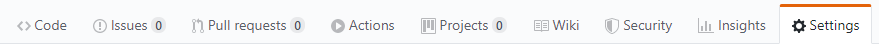

# Intersection component

--------------
## Methodology
- weekly planning
- milestones for long term goals (about two months)
- demo every 4 weeks
  - involve reference group from REP
- possibly split planning of user stories and discuss technical issues in 2 separate meetings
- daily standups
- Milestone in 2nd demo
-------------
Language: typescript

Strategy: same strategy as Videx used in the VidEx-map repository (TODO: add details)

Browser support: Edge, Chrome, Firefox, Safari

Repository: one repo per component, some additional repositories for common utilities

Open source: get in touch with POs

Styling: no real preference, to be defined. Videx map uses SCSS, WellX has to figure out integration with Sencha

Testing:
  - we want unit tests, with test coverage (treat with care)
  - snapshot tests nice to have
  - simulation test: testing basic interaction on all browsers (browser support)
    - can take quite some efforts, maybe ont highest priority
    - decide tools and target platforms

Linting: yes, lint in CI, use automatic formatting

Dependencies: _d3_, maybe _emotion_
  - evaluate if other dependencies might be necessary/interesting
  - visualization layers can drag in additional dependencies
  - dependnecies should not be included unless used by some specific layer

Accessibility: try our best to comply with WCAG2.1, possibly automatically check this in the future

CI: let's start with Github actions, evaluate different solutions if issues arise later on

Publishing:
  - have automatic publishing
  - connect to tagged versions in the repo
  - would be good to be able to have a nightly package
  - details to be figured out

TODO Set up daily standups
TODO Set up planing meetings with POs

-----------

Typescript template for npm packages with testing and automatic documentation.

- **Compiler**: [Typescript](https://www.npmjs.com/package/typescript)
- **Module bundler**: [Rollup](https://www.npmjs.com/package/rollup)
- **Testing**: [Jest](https://www.npmjs.com/package/jest)
- **Documentation**: [TypeDoc](https://www.npmjs.com/package/typedoc)
- **Code compressor**: [Terser](https://www.npmjs.com/package/terser)

## Repository

- [GitHub](https://github.com/equinor/videx-npm-template)

## Setup guide

### Cloning repository

Start by cloning the template repository to desired directory.

```
git clone https://github.com/equinor/videx-npm-template.git
```

### Modify package.json

Fields that need to be modified are:

- **name**: The name of the npm package.
- **description**: The description of the npm package.
- **repository.url**: Should point to the GitHub repository.
- **keywords**: Keywords to make it easier to find the package on npm.
- **author**: Package author. For multiple authors, consider using '[contributors](https://docs.npmjs.com/files/package.json#people-fields-author-contributors)'.
- **bugs.url**: Should point to "GitHub repository"/issues.
- **homepage**: Could point to "GitHub repository"#readme.

### Install dependencies

Install all dev dependencies defined in package.json using node.

```
npm install
```

## Usage

### Creating package

The entry point for the actual npm package is defined as 'src/index.ts'. This can be changed within 'rollup.config.js'.
Any public variables, functions and classes should be exported within this file.

### Document generation

```
npm run docs
```

Three part process:

1. Deletes the docs-folder, if it exists.
2. Automatically generates documentation to a new docs-folder.
3. Copies the images-folder and .nojekyll into docs.

The copying of images makes it possible to refer to local images within the README!

The empty .nojekyll file makes it possible to upload html pages starting wth underscore to GitHub pages.

### Creating tests

All tests are defined within the test-folder. Jest naming convention is to place tests for SOMESCRIPT.ts in a single file SOMESCRIPT.test.ts.

### Testing

```
npm run test
```

Executes all tests defined within the test folder.

```
npm run test:watch
```

Executes all tests, but does not return immediately. Makes it possible to re-run failed tests quickly.

### Building/Compiling

```
npm run build
```

Compiles the code found within the src-folder. Build is outputted to a new dist-folder.

### Publication

```
npm run pub
```

Attemps to publish the package to npm. As part of the publishing process, the source code is re-compiled.

## Publish documentation

GitHub pages is used to show documentation. To set up GitHub pages, start by navigating to the settings tab within the GitHub repository.



Scroll down and set GitHub pages source to the docs-folder of the master branch.


Publishing the documentation will produce a link. This link can be included in the README for easy navigation.


Sample documentation can be found [here](https://equinor.github.io/videx-npm-template/).

## Sample function

<table style="width:auto;">
  <tr>
    <td><a href="https://equinor.github.io/videx-npm-template/modules/_index_.html#hello">hello</a></td>
  </tr>
</table>

<br/>


