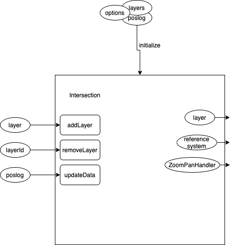

# Intersection API

When instantiating the intersection, you need to supply layers to be mounted and displayed, position log (an array of objects with easting, northing, md and tvd), and any additional options. Examples of additional options would be scaleOptions, to specify your domain, and dimensions, and axis options (currently only needing name of the axes and unit of measure).
